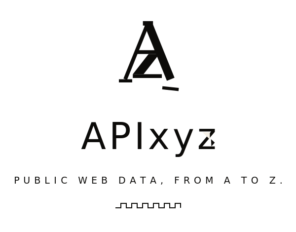

  

<em>Public web data, from A to Z.</em>

---

APIxyz publishes public web data actors, for people and for AI agents, that read only what a logged-out browser can already see, price per result, and document every field they return.

## The line

| Source | Actor | Price |
|---|---|---|
| LinkedIn | Jobs Scraper | $2 / 1k jobs |
| LinkedIn | Company Jobs Monitor | $3 / 1k postings |
| LinkedIn | Jobs by Location | $2 / 1k jobs |
| LinkedIn | Hiring Signals | $4 / 1k signals |
| LinkedIn | Job Market Snapshot | $3 / 1k rows |
| Instagram | Profile Scraper | $1 / 1k profiles |
| European registries | VAT Status Monitor | $5 / 1k checks |
| European registries | Company Change Monitor | $5 / 1k companies |
| European registries | Company Enrichment, VAT Verified | $3 / 1k records |
| European registries | New Registrations Feed | $4 / 1k records |
| Google Maps | Lead Scraper | $2 / 1k places |
| Google Ads | Transparency Scraper | $5 / 1k ads |
| X | Ads Repository Downloader | $3 / 1k ads |
| The open web | Content Crawler for Agents | $1.50 / 1k pages |
| European registries | DSA Ad Library | $5 / 1k ads |

## Standard

Every actor reads pages a browser reaches without an account. No stored session at any point, on any source. That posture is the one that held in hiQ Labs v. LinkedIn and in Meta v. Bright Data.

Every actor clears a default-input run before it is queued, which is the check the platform runs automatically. Every actor ships an output schema with typed fields and is callable as an MCP tool.

Pricing is per result returned. Runs that return no rows are not charged.

## Arithmetic

Google Places Text Search Pro lists at $32 per 1,000 lookups. The Maps lead actor charges $2 per 1,000.

---

<a href="https://apify.com/apixyz">Store</a> · <a href="https://tareketman.github.io/apixyz-docs">Documentation</a>

